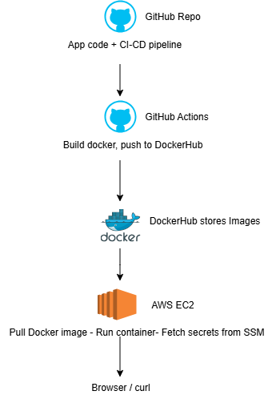

### CI/CD Pipeline on AWS

1. Use GitHub Actions + AWS

2. Deploy a sample web app Node.js

3. Automate build → test → deploy → rollback

4. Use EC2 for hosting


## Tech Stack

- AWS EC2 (hosting)
- AWS SSM Parameter Store (secrets)
- Docker (containerization)
- GitHub Actions (CI/CD)
- Node.js + Express (sample app)
- Security: IAM roles for secrets (no hardcoded credentials)

## Architecture Diagram



## Setup & Deployment

1. GitHub Actions automatically builds Docker image from `app/` and pushes to Docker Hub.
2. EC2 pulls latest Docker image and runs container.
3. App fetches login credentials from AWS SSM Parameter Store.

## Demo Account

- URL: http://<EC2_PUBLIC_IP>/login
- Email: hire-me@anshumat.org
- Password: HireMe@2025!

## How to Test

Use curl or browser:

```
curl -X POST http://<EC2_PUBLIC_IP>/login \
  -H "Content-Type: application/json" \
  -d '{"email":"hire-me@anshumat.org","password":"HireMe@2025!"}'
```

Expected result: {"message":"Login successful"}

## Step-by-Step Implementation

### 1. GitHub Repository

- Created a repo with structure:

```
/pipeline → GitHub Actions workflow
/app → Sample Node.js app
README.md
/demo-images (optional)
```

### 2. EC2 Setup

- Launched **Ubuntu EC2** instance (free-tier eligible)
- Opened **ports 22, 80, 3000** in Security Group
- Attached IAM role with `AmazonSSMReadOnlyAccess`
- Installed Docker on EC2

### 3. Sample App

- Node.js + Express app in `/app`
- Endpoint `/login` authenticates using credentials stored in AWS SSM Parameter Store
- `package.json` includes `express` and `aws-sdk` dependencies
- Dockerfile created to build container

### 4. Secrets Management

- Created **SecureString parameter** in AWS SSM Parameter Store:

```
Name: /devops/demo_user
Value: {"email":"hire-me@anshumat.org","password":"HireMe@2025!"}
```

- Updated `index.js` to fetch secret from SSM
- Verified **region matches** EC2 region (`us-east-2`)
- No hardcoded credentials used

### 5. Docker Container

- Dockerfile builds Node.js app and installs dependencies
- Container exposes port 3000 (mapped to 80 on EC2)
- Tested container locally and on EC2

### 6. GitHub Actions CI/CD

- Workflow triggers on **push to main branch**
- Steps:
  1. Checkout code
  2. Build Docker image (`aws-sdk` included)
  3. Push to Docker Hub
  4. SSH to EC2 → pull new image → restart container
- Verified workflow ran successfully

### 7. Testing

- Verify container running:

```
docker ps
```

_NOTES:_

1. We used AWS EC2 to host our app and Docker to containerize it, making deployment consistent and reproducible.
2. GitHub Actions automates the CI/CD workflow: building the Docker image, pushing it to Docker Hub, and updating EC2 automatically.
3. AWS SSM Parameter Store securely stores the demo credentials, accessed via an IAM role attached to the EC2 instance, so no secrets are hardcoded.
4. This stack ensures a secure, automated, and reproducible deployment pipeline that meets DevOps best practices.
5. Rollback is handled by keeping previous Docker image versions. In case of failure, the EC2 instance can quickly redeploy the last working container using its SHA tag. This ensures safe deployment without downtime.
